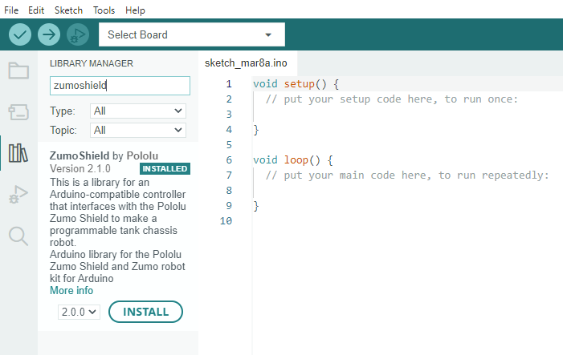

# SumoRobotLib
Here you will find the SumoRobot library and it's arduino files.

To get started you will first need to have the [Arduino IDE](https://www.arduino.cc/en/software) installed.

Then you will have to go to the library manager and install the ZumoShield library.



You can then download the files from this github page (Code -> Download ZIP).

When the files are downloaded you will need extract the contents and open the SumoLib folder.
In the SumoLib folder there is two more folders. Open `ArduinoSumoCode` folder. Then open double-click ArduinoSumoCode.ino.

Like this:
```
SumoLib -> ArduinoSumoCode -> ArduinoSumoCode.ino
```

The other folder called `ArduinoSumoCodeBonus` is for when we have extra time on our hands.
